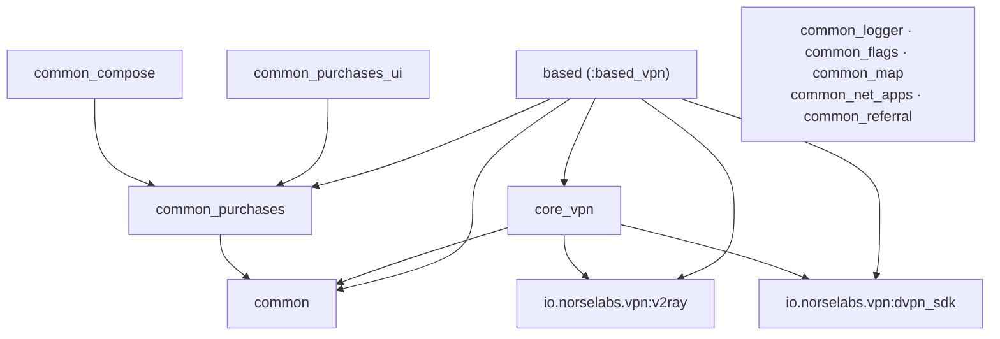

# Architecture

How this monorepo is organized internally: the module map, the two-layer design
(`core_vpn` ↔ `based`), and the extension points apps build on. For the
platform-wide picture (how this repo relates to `vpn-v2ray`, `dvpn-sdk`, and the
shipping apps) see the SolarLabs top-level `docs/architecture.md`.

## Module dependency graph



`based` also depends on `common_logger` and `common_flags`. Leaf `common_*`
modules have no internal dependencies. Dependencies point one way; publish in
that order (see [integration.md](integration.md)).

## The two layers

### `core_vpn` — the engine room

Low-level VPN orchestration, no UI. Key components:

- `VPNConnector` / `VPNDriver` — drive connect/disconnect over the tunnel.
- `DnsConfigurator` — DNS server selection.
- `SplitTunnelingConfigurator` — per-app routing.
- `UserInitializer` — device/user bootstrap (registration, version).
- `NetworkStateMonitor` — connectivity changes.
- `DestinationStorage`, `CoreStorage` — selected destination + persisted prefs.

Depends on `io.norselabs.vpn:v2ray` (tunnel engine) and `io.norselabs.vpn:dvpn_sdk`
(backend client), plus `common`.

### `based` (module `:based_vpn`) — the high-level layer

What a wrapper app builds on. Package layout under
`io/norselabs/vpn/based/`:

| Package | Contents |
|---|---|
| `viewModel/` | Voyager `ScreenModel` ViewModels: `dashboard`, `settings`, `countries`, `cities`, `servers`, `split_tunneling`, `fragment` |
| `di/` | Hilt modules wiring the object graph (app, V2Ray, storage, network/DVPN) |
| `app_config/` | `AppConfig` — the contract a wrapper app implements |
| `core_impl/vpn/` | `VPNDriverImpl` — bridge between `dvpn_sdk` credentials and the `v2ray` tunnel |
| `storage/` | `AppStorage` (onboarding, rating, etc.) |
| `language/` | `LanguageManager` (i18n) |
| `network/` | DNS request helpers |
| `error/` | `BaseError` |

`based` `api`-exposes `v2ray`, `dvpn_sdk`, `core_vpn`, `common`, `common_logger`,
`common_purchases`, and `common_flags`, so a consumer gets the whole graph from a
single dependency.

## The extension contract — `AppConfig`

A wrapper app implements `AppConfig` and provides it as a Hilt singleton; `based`
injects it everywhere it needs app-specific values:

```kotlin
interface AppConfig {
  fun getAppId(): String
  fun getAppVersion(): String
  fun getPackage(): String
  fun getBaseUrl(): String
  fun getDnsDomain(): String
  fun getProxy(): String?
  fun getAppToken(): String
}
```

That single contract plus the branded theme/resources is, in the thin-wrapper
pattern, almost all an app needs to supply — `based` provides the ViewModels and
DI for the rest.

## Runtime bridge

`VPNDriverImpl` (in `core_impl/vpn/`) is where the two foundation libraries
meet: it asks `dvpn_sdk`'s `DVPNClient` for credentials/servers, turns them into a
`VpnProfile`, drives `v2ray`'s `V2RayRepository` to raise the tunnel, and observes
`connectionState`. `DashboardScreenViewModel` renders that state. On network
change it calls `resetConnectionPool()` so the SDK rebuilds its client.

`core_vpn`'s connection analytics (`ConnectionLifecycleListener`) is an optional
extension point: a wrapper app may bind its own implementation as a Hilt
singleton (like `AppConfig`); otherwise `based` wires a no-op listener.
